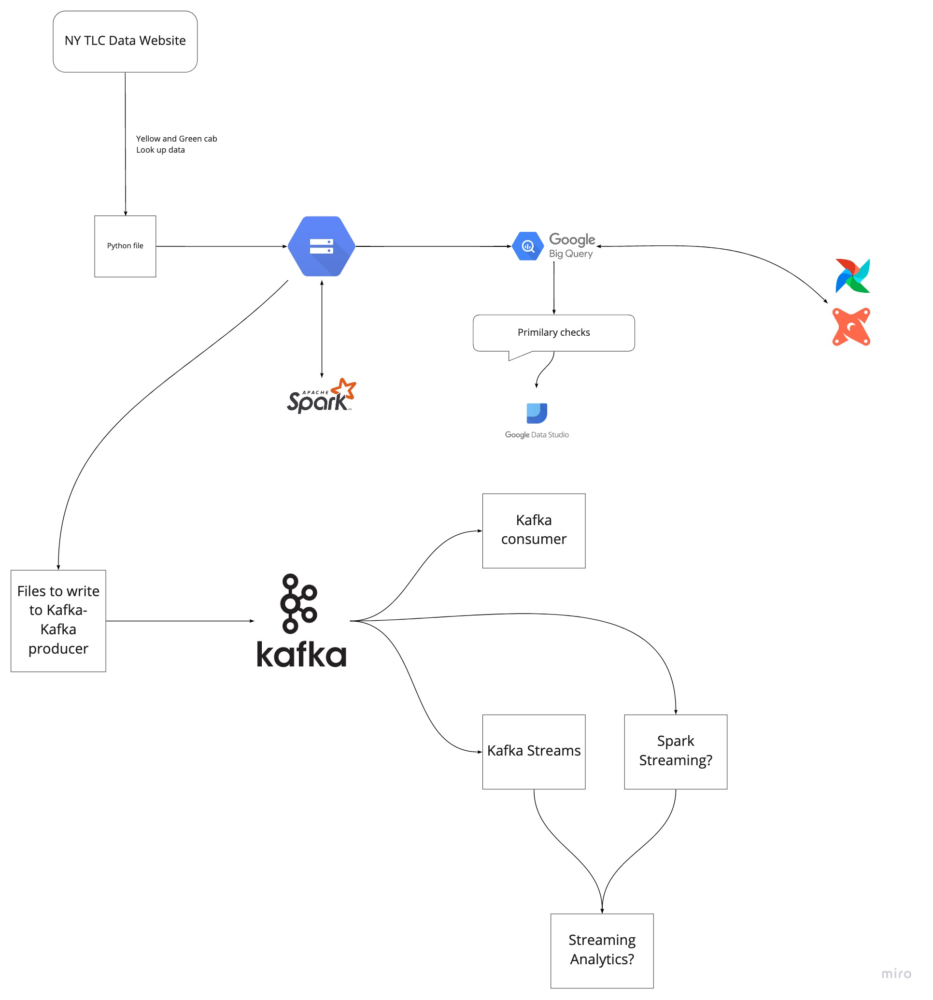

## Syllabus

### [Week 1: Introduction & Prerequisites](week_1_basics_n_setup)

* Course overview
* Introduction to GCP
* Docker and docker-compose 
* Running Postgres locally with Docker
* Setting up infrastructure on GCP with Terraform
* Preparing the environment for the course
* Homework

### [Week 2: Data ingestion](week_2_data_ingestion)

* Data Lake
* Workflow orchestration
* Setting up Airflow locally
* Ingesting data to GCP with Airflow
* Ingesting data to local Postgres with Airflow
* Moving data from AWS to GCP (Transfer service)
* Homework

### [Week 3: Data Warehouse](week_3_data_warehouse)

Goal: Structuring data into a Data Warehouse

* Data warehouse (BigQuery)
    * What is a data warehouse solution
    * What is big query, why is it so fast, Cost of BQ,
    * Partitoning and clustering, Automatic re-clustering
    * Pointing to a location in google storage
    * Loading data to big query & PG -- using Airflow operator?
    * BQ best practices
    * Misc: BQ Geo location, BQ ML 
    * Alternatives (Snowflake/Redshift)

### [Week 4: Analytics engineering](week_4_analytics_engineering/taxi_rides_ny/)

Goal: Transforming Data in DWH to Analytical Views

* Basics of analytics engineering
* Developing a dbt project
* Visualising the data in Google data studio

### [Week 5: Batch processing](week_5_batch_processing)

Goal: 

* Distributed processing (Spark)
    * What is Spark, spark cluster 
    * Explaining potential of Spark 
    * What is broadcast variables, partitioning, shuffle
    * Pre-joining data
    * use-case
    * What else is out there (Flink)
* Extending Orchestration env (airflow)
    * Big query on airflow
    * Spark on airflow

### [Week 6: Streaming](week_6_stream_processing)

Goal: 

* Basics
    * What is Kafka
    * Internals of Kafka, broker
    * Partitoning of Kafka topic
    * Replication of Kafka topic
* Consumer-producer
* Schemas (avro)
* Streaming
    * Kafka streams
* Kafka connect
* Alternatives (PubSub/Pulsar)

### [Week 7: Project](project)

Duration: 1 weeks

* Upcoming buzzwords
  *  Delta Lake/Lakehouse
    * Databricks
    * Apache iceberg
    * Apache hudi
  * Data mesh
  * KSQLDB
  * Streaming analytics
  * Mlops
 
## Overview

### Architecture diagram

### Technologies
* *Google Cloud Platform (GCP)*: Cloud-based auto-scaling platform by Google
  * *Google Cloud Storage (GCS)*: Data Lake
  * *BigQuery*: Data Warehouse
* *Terraform*: Infrastructure-as-Code (IaC)
* *Docker*: Containerization
* *SQL*: Data Analysis & Exploration
* *Airflow*: Pipeline Orchestration
* *DBT*: Data Transformation
* *Spark*: Distributed Processing
* *Kafka*: Streaming

## Tools 

* Docker and Docker-Compose
* Python 3 (e.g. via [Anaconda](https://www.anaconda.com/products/individual))
* Google Cloud SDK 
* Terraform
